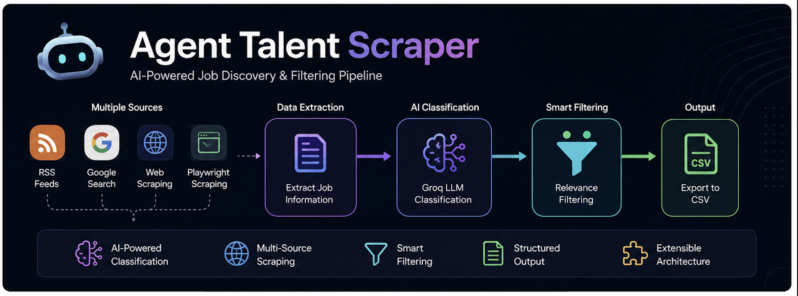

# Agent Talent Scraper

AI-powered job scraping and intelligent filtering pipeline for discovering relevant AI/ML opportunities from multiple online sources.

---

## Features

- Multi-source job scraping
- RSS feed ingestion
- Google-based scraping
- Playwright browser automation
- AI-powered job classification
- Intelligent filtering pipeline
- CSV export support
- Modular scraper architecture

---

## Tech Stack

- Python
- Playwright
- Groq API
- BeautifulSoup4
- Feedparser
- Requests
- PostgreSQL (optional)

---

## Project Structure

```bash
agentalent-scraper/
│
├── classifier.py
├── classifier_direct.py
├── classifier_simple.py
├── scraper_google.py
├── scraper_playwright.py
├── scraper_rss.py
├── pipeline.py
├── filter_jobs.py
├── config.py
├── requirements.txt
└── README.md
```

---

## Installation

Clone repository:

```bash
git clone https://github.com/Litap-AI/Agent-Talent-scrapper.git
cd Agent-Talent-scrapper
```

Create virtual environment:

```bash
python3 -m venv .venv
source .venv/bin/activate
```

Install dependencies:

```bash
pip install -r requirements.txt
```

Install Playwright browsers:

```bash
playwright install
```

---

## Environment Variables

Create `.env` file:

```env
GROQ_API_KEY=your_api_key_here
```

---

## Run Pipeline

```bash
python pipeline.py
```

---

## Current Capabilities

- Scrapes job listings from multiple sources
- Extracts structured job data
- Uses LLM-based filtering for AI/ML relevance
- Exports processed opportunities for analysis

---

## Future Improvements

- Async scraping engine
- Job ranking system
- Vector search for semantic matching
- Streamlit dashboard
- Recommendation engine
- Docker deployment
- Scheduled automation
- AI agent workflow integration

---

## Disclaimer

This project is intended for educational and research purposes.
Please respect website terms of service while scraping.

---

## Author

Rohit Patil
